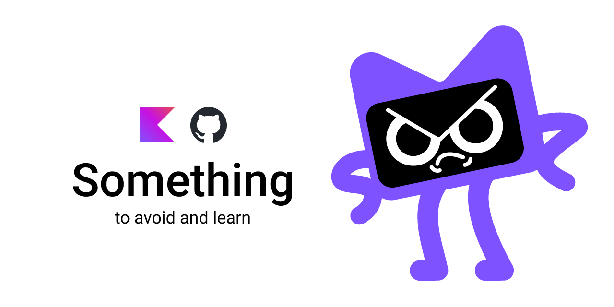

# Something to avoid in Kotlin

<p align="center">
   
</p>


[](https://opensource.org/licenses/Apache-2.0)


This project showcases some of the common mistakes in Kotlin programming and demonstrates best practices to avoid them.

## 🚀 Quick Start

1. Clone the repository:
   ```
   git clone https://github.com/ArjunJadeja/Something.git
   ```
2. Open the project in your favorite IDE.
3. Run the `main` function in [`Main.kt`](src/main/kotlin/Main.kt) to see the safe practices in action.
4. Explore the [`Avoid.kt`](src/main/kotlin/Avoid.kt) file to see common mistakes and the [`Instead.kt`](src/main/kotlin/Instead.kt) file for correct implementations.

## 📁 Project Structure

- [`Main.kt`](src/main/kotlin/Main.kt): Entry point of the application
- [`Something.kt`](src/main/kotlin/Something.kt): Base class definition
- [`Avoid.kt`](src/main/kotlin/Avoid.kt): Examples of common Kotlin mistakes
- [`Instead.kt`](src/main/kotlin/Instead.kt): Correct implementations and best practices

## 🔍 Code Samples

Here's a summary of what you'll find in the code samples:

### Base Class ([Something.kt](src/main/kotlin/Something.kt))
```kotlin
open class Something : Any()
```

### Common Mistakes ([Avoid.kt](src/main/kotlin/Avoid.kt))
This file contains examples of:
1. Uninitialized `lateinit` properties
2. Force unwrapping null values
3. Unsafe casting
4. Accessing nullable collections without checks
5. Unsafe iteration over nullable lists
6. Accessing properties in custom getters before initialization
7. Shadowing variables in lambdas

[View full Avoid.kt](src/main/kotlin/Avoid.kt)

### Best Practices ([Instead.kt](src/main/kotlin/Instead.kt))
This file demonstrates the correct way to handle:
1. Safe initialization of properties
2. Null safety with safe call operator and Elvis operator
3. Safe casting
4. Safe access to nullable collections
5. Safe iteration over nullable lists
6. Proper initialization in custom getters
7. Avoiding variable shadowing in lambdas

[View full Instead.kt](src/main/kotlin/Instead.kt)

## 🎓 What You'll Learn

1. Handling uninitialized properties
2. Safe null handling
3. Type-safe casting
4. Working with nullable collections
5. Proper use of custom getters
6. Avoiding variable shadowing in lambdas
7. Safe iteration over nullable lists

## 🤝 Contributing

Contributions are welcome! If you have additional examples of common Kotlin mistakes or best practices, please follow these steps:

1. Fork the repository
2. Create a new branch (`git checkout -b feature/your-feature-name`)
3. Add your examples to the appropriate files
4. Commit your changes (`git commit -am 'Add some feature'`)
5. Push to the branch (`git push origin feature/your-feature-name`)
6. Create a new Pull Request

## ⭐ Show Your Support

If you like this project, please give it a star on GitHub. It helps others discover this resource!

## 📚 Additional Resources

- [Kotlin Playground](https://play.kotlinlang.org/)
- [Kotlin Official Documentation](https://kotlinlang.org/docs/home.html)
- [Kotlin Coding Conventions](https://kotlinlang.org/docs/coding-conventions.html)

Happy coding, and remember: learn from mistakes to write better Kotlin code! 🚀

## 📄 License
```
Copyright (C) 2024 Arjun Jadeja (arjunjadeja.com)

Licensed under the Apache License, Version 2.0 (the "License");
you may not use this file except in compliance with the License.
You may obtain a copy of the License at

     http://www.apache.org/licenses/LICENSE-2.0

Unless required by applicable law or agreed to in writing, software
distributed under the License is distributed on an "AS IS" BASIS,
WITHOUT WARRANTIES OR CONDITIONS OF ANY KIND, either express or implied.
See the License for the specific language governing permissions and
limitations under the License.
```