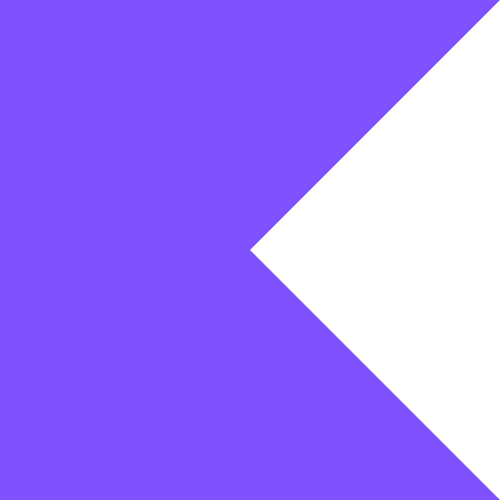

#  Something to avoid and learn

<p align="center">
   
</p>

[](https://opensource.org/licenses/Apache-2.0)
[](https://mailchi.mp/kotlinweekly/kotlin-weekly-424)
[](https://github.com/ArjunJadeja)


## 💡 About Project

This project showcases common mistakes in Kotlin programming and alternate approaches to avoid them, as well as useful learnings and techniques.

## 🚀 Quick Start

1. Clone the repository:
   ```
   git clone https://github.com/ArjunJadeja/Something.git
   ```
2. Open the project in your favorite IDE.
3. Explore the `mistakes` and `learnings` folders.

## 🎓 Mistakes

Here's a list of the mistakes added:

1. [Uninitialized Properties](src/main/kotlin/mistakes/UninitializedProperties.kt)
2. [Null Safety](src/main/kotlin/mistakes/NullSafety.kt)
3. [Unsafe Casting](src/main/kotlin/mistakes/UnsafeCasting.kt)
4. [Nullable Collections](src/main/kotlin/mistakes/NullableCollection.kt)
5. [Custom Getters](src/main/kotlin/mistakes/CustomGetter.kt)
6. [Lambda Variable Shadowing](src/main/kotlin/mistakes/LambdaVariableShadowing.kt)

## 📚 Learnings

Here's what we've learned so far:

1. [Using then with Modifier in Jetpack Compose](src/main/kotlin/learnings/ThenWithComposeModifier.kt)

## 📁 Project Structure

The project is organized into `mistakes` and `learnings` folders, each containing specific examples.

```
Something/
├── src/
│   └── main/
│       └── kotlin/
│           ├── Main.kt
│           ├── Something.kt
│           ├── mistakes/
│           │   ├── CustomGetter.kt
│           │   ├── LambdaVariableShadowing.kt
│           │   ├── NullSafety.kt
│           │   ├── NullableCollection.kt
│           │   ├── UninitializedProperties.kt
│           │   └── UnsafeCasting.kt
│           └── learnings/
│               └── ThenWithComposeModifier.kt
├── .gitignore
├── LICENSE
├── README.md
└── build.gradle.kts
```

## 🎯 Future Goals

The goal is to continuously learn and grow from real-world mistakes and discoveries.

## 🗺️ Roadmap

There's no fixed roadmap for this project. The approach is to:

1. Add new learnings and mistakes as we encounter them.
2. Welcome contributions from the community.

## 🤝 Contributing

Contributions from Kotlin developers of all experience levels are welcomed! Whether you're a beginner or an experienced developer, your contribution can help others learn.

Please check our [Contribution Guidelines](GUIDELINES.md) for more details on how to contribute.

## ⭐ Show Your Support

If you find this project helpful, please give it a star on GitHub. It helps others discover this resource!

## 🔗 Connect

Feel free to connect with me:

[Arjun Jadeja - LinkedIn](https://www.linkedin.com/in/arjun-jadeja/)

## 📚 Additional Resources

- [Kotlin Playground](https://play.kotlinlang.org/)
- [Kotlin Official Documentation](https://kotlinlang.org/docs/home.html)
- [Kotlin Coding Conventions](https://kotlinlang.org/docs/coding-conventions.html)

Happy coding, and remember: every mistake and learning is an opportunity! 🚀

## 📄 License

```
Copyright (C) 2024 Arjun Jadeja (arjunjadeja.com)

Licensed under the Apache License, Version 2.0 (the "License");
you may not use this file except in compliance with the License.
You may obtain a copy of the License at

     http://www.apache.org/licenses/LICENSE-2.0

Unless required by applicable law or agreed to in writing, software
distributed under the License is distributed on an "AS IS" BASIS,
WITHOUT WARRANTIES OR CONDITIONS OF ANY KIND, either express or implied.
See the License for the specific language governing permissions and
limitations under the License.
```